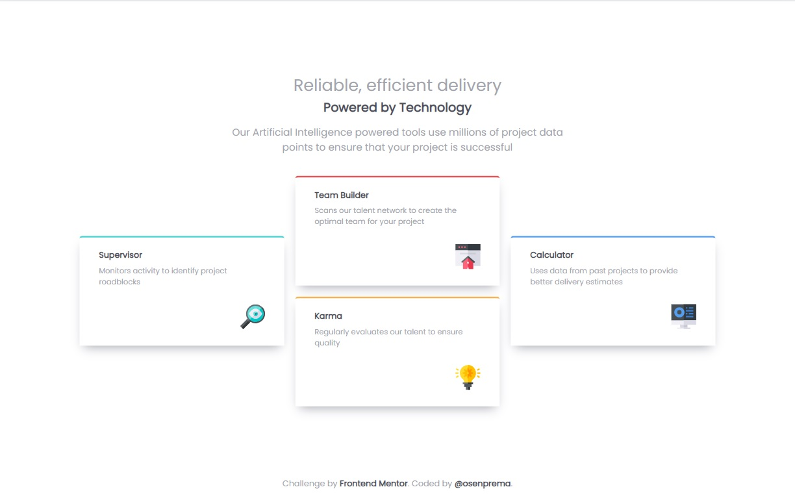

# Frontend Mentor - Four card feature section solution

This is a solution to the [Four card feature section challenge on Frontend Mentor](https://www.frontendmentor.io/challenges/four-card-feature-section-weK1eFYK). Frontend Mentor challenges help you improve your coding skills by building realistic projects. 

### Screenshot

### Built with

- Semantic HTML5 markup
- CSS custom properties
- Flexbox
- CSS Grid
- Mobile-first workflow

### What I learned

Using CSS Grid. I already had some idea of ​​how it works, because I've used Bootstrap before, so it wasn't that complicated.

## Author

- Frontend Mentor - [@osenprema](https://www.frontendmentor.io/profile/osenprema)